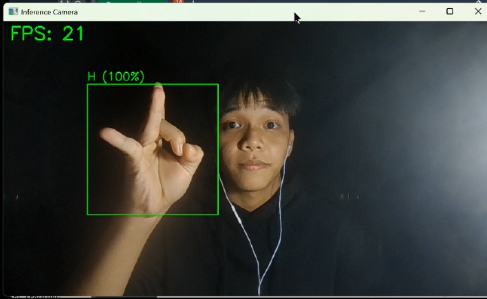

# sign-language


> Hệ thống nhận diện bảng chữ cái Thủ ngữ Việt Nam thời gian thực dựa trên đặc trưng khung xương (Landmarks) sử dụng Deep Learning.


## Introduction
Dự án này xây dựng một hệ thống nhận diện thủ ngữ gọn nhẹ và hiệu quả cao, tập trung vào bảng chữ cái tiếng Việt (23 nhãn: 22 chữ cái không dấu và trạng thái nghỉ). Thay vì sử dụng mạng CNN nặng nề trên ảnh thô, hệ thống sử dụng **MediaPipe** để trích xuất 21 điểm mốc xương tay và đưa vào mạng nơ-ron **MLP (Multi-Layer Perceptron)**.

**Điểm đáng chú ý:**
* **Nhẹ:** Kích thước model $\approx$ 0.2 MB.
* **Ổn định:** Tích hợp bộ lọc **Moving Average Filter** giảm rung hiệu quả.
* **Chính xác:** Độ chính xác > 98% trên tập kiểm thử.
## Installation
1.  **Clone dự án:** 
```bash
    git clone https://github.com/tavenguyen/sign-language.git
    cd sign-language
```

2.  **Tạo môi trường ảo:**
```bash
    conda create -n sign-language python=3.9 -y
    conda activate sign-language
```

3.  **Cài đặt thư viện:**
```bash
    pip install -r requirements.txt
```
## Usage
Hệ thống được thiết kế theo quy trình 4 bước:
### Bước 1: Thu nhập dữ liệu
Chạy script để thu thập dữ liệu từ Webcam.
```bash
python src/collect_data.py
```
- Nhấn phím A: Tự động lưu dữ liệu.
- Nhấn phím Space: Lưu dữ liệu từng cái một.
- Nhấn phím Q: Thoát
### Bước 2: Xử lý dữ liệu
Chuẩn hóa dữ liệu (Min-Max Normalization), chuyển đổi tọa độ tương đối và Encoding nhãn.
```bash
python src/process_data.py
```

### Bước 3: Huấn luyện mô hình
Sau khi đã cạy xong bước xử lý dữ liệu, ta sẽ có đầu ra dataset dùng để train.
```bash
python src/train.py
```
- Đầu ra: model/keypoint_classifier.h5 và model/scaler.p.
### Bước 4: Chạy nhận diện
Chạy ứng dụng nhận diện thời gian thực
```bash
python src/inference_mlp.py
```

## Project Structure
File data sẽ không có raw_images bởi vì kích thước của nó quá lớn.
```text
sign-language/
├── data/                    
│   ├── keypoints/           
│   └── raw_images/          
├── dataset/                 
│   ├── raw_data.csv         
│   └── label_map.json       
├── model/                   
│   ├── keypoint_classifier.h5
│   └── scaler.p
├── src/                     
│   ├── collect_data.py      
│   ├── process_data.py      
│   ├── train.py             
│   └── inference_mlp.py     
├── requirements.txt         
└── README.md
```

## Acknowledgement
Cảm ơn các bạn Phan Thanh Quốc, Nguyễn Thuỳ Yến Nhi, Trần Quốc Trấn đã tham gia hỗ trợ xây dựng bộ dữ liệu.
